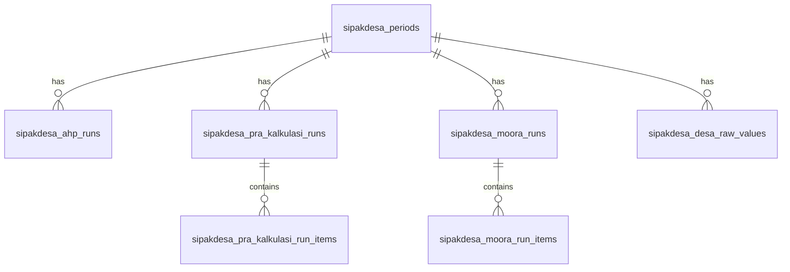

# SIPAKDESA SLEMAN
> **Sistem Pendukung Keputusan Alokasi Dana Desa (ADD) Kabupaten Sleman**
> 
> Instrumen digital berbasis Decision Support System (DSS) yang digunakan oleh Dinas Pemberdayaan Masyarakat dan Kalurahan (DPMK) Kabupaten Sleman untuk mengotomatisasikan, merasionalkan, dan mendistribusikan pagu anggaran Alokasi Dana Desa (ADD) kepada **86 Kalurahan** secara objektif, adil, transparan, dan akuntabel sesuai dengan regulasi Peraturan Bupati (Perbup) Sleman yang berlaku.

---

## 1. Metodologi Pendukung Keputusan (Hybrid DSS)

Untuk menghasilkan pembagu pagu yang bebas dari subjektivitas administratif, SIPAKDESA mengintegrasikan dua metode optimasi matematis:

### A. Analytic Hierarchy Process (AHP)
Metode ini digunakan untuk menghitung bobot prioritas tingkat kepentingan relatif masing-masing kriteria evaluasi (C1 s.d C5 atau kriteria kustom tambahan).
* **Skala Perbandingan**: Mengadopsi skala 1–9 Saaty untuk input perbandingan berpasangan (pairwise comparison) pada sel segitiga atas matriks kriteria.
* **Reciprocal & Diagonal**: Sel diagonal terkunci pada nilai `1` dan sel segitiga bawah diisi nilai pecahan reciprocal secara otomatis.
* **Consistency Ratio (CR)**: Sistem menghitung nilai Consistency Index (CI) dan Consistency Ratio (CR) secara real-time. Bobot kriteria hanya dapat disimpan jika matriks dinilai konsisten secara matematis (**CR < 0.10**).

### B. Belanja Earmark (Belanja Kaku Pra-Kalkulasi)
Sebelum pagu disebar menggunakan MOORA, sistem melakukan kalkulasi penguncian belanja wajib pegawai/operasional (*Earmark*) untuk mengamankan belanja pokok kalurahan:
* **Gaji Pokok & Tunjangan Siltap**: Siltap bulanan Lurah, Carik, Kepala Seksi/Kaur, dan Dukuh.
* **Tunjangan BPKal**: Formasi tunjangan bulanan (Ketua, Wakil, Sekretaris, Bidang, Anggota BPKal) terintegrasi dengan template formasi (misal template 9 kursi).
* **Jaminan Kesehatan & Ketenagakerjaan**: Potongan premi BPJS Kesehatan (4%) dan BPJS Ketenagakerjaan (1%) berbasis nominal UMK Sleman aktif dan jumlah staf tanggungan.
* **Kebijakan Tambahan**: Akumulasi opsional untuk THR dan Gaji Ke-13 (masing-masing senilai 1 bulan gaji siltap pokok).
* **Sisa Pagu Bersih (ADD Kewenangan)**: Sisa alokasi pagu bersih setelah dikurangi potongan belanja kaku inilah yang kemudian dikirim ke modul MOORA untuk diranking dan dialokasikan secara proporsional.

### C. Multi-Objective Optimization on the basis of Ratio Analysis (MOORA)
Metode optimasi multi-objektif ini memproses sisa pagu bersih (ADD Kewenangan) untuk didistribusikan kepada 86 Kalurahan:
* **Normalisasi Matriks**: Mengubah nilai mentah kriteria menjadi matriks normalisasi menggunakan pembagi kuadratik sum.
* **Optimasi Rasio**: Mengalikan matriks ternormalisasi dengan bobot prioritas ($w_j$) hasil AHP.
* **Skor Kelayakan ($Y_i$)**: Menghitung selisih kriteria benefit (menguntungkan, seperti jumlah penduduk miskin C2, indeks kesulitan geografis C5, dll.) dan kriteria cost (merugikan/pengurang).
* **Alokasi Neto Proporsional**: Mengalokasikan dana secara dinamis berdasarkan porsi nilai kelayakan positif ($Y_i$) masing-masing kalurahan demi mewujudkan asas *Zero Gap* (seluruh anggaran daerah terdistribusi habis tanpa sisa).

---

## 2. Fitur-Fitur Utama Sistem

* **Manajemen Multi-Role (RBAC)**: Pembatasan otorisasi antara **Super Admin** (akses penuh termasuk manajemen akun staf dan suspend akun) dan **Admin** (akses siklus kalkulasi).
* **Manajemen Siklus & Gembok Periode (Period Lock)**: Memungkinkan administrator mengunci (*Lock*) atau membuka kunci (*Unlock*) periode tahun anggaran guna mencegah manipulasi data transaksi yang tidak sah pasca-audit.
* **Master Kriteria & Parameter Dinamis**: Fleksibilitas menambahkan kriteria kustom benefit/cost. Parameter kualitatif hanya menampilkan inputan *Label* dan *Score* (menyembunyikan min/max). Penambahan kriteria baru otomatis memicu reset bobot AHP periode berjalan demi integritas matematis.
* **Master Data Kalurahan**: Input data profil 86 kalurahan dengan inputan dinamis (numeric untuk kriteria kuantitatif, select-dropdown untuk kualitatif). Dilengkapi fitur **Salin Data** antar-tahun anggaran dan **Export PDF** rekap data.
* **Ekspor Laporan & Draf SK Bupati**: Beralih tampilan tab antara **Tabel Analisis** dan **Pratinjau Lampiran Bupati**. Mendukung pengeditan metadata SK (Nomor, Tanggal, Nama Bupati), ekspor PDF Portrait resmi, serta ekspor spreadsheet Excel (.xls) lengkap dengan gridlines.
* **Keamanan Sistem**:
  * Autentikasi JWT Supabase Auth.
  * Kebijakan keamanan sandi minimal 8 karakter dengan kombinasi karakter.
  * Penanganan *race condition* instan untuk deteksi akun suspended (ditangguhkan) saat login.
  * Sistem penguncian otomatis (Auto-Logout) akibat ketidakaktifan aktivitas mouse/keyboard selama **15 menit**.

---

## 3. Struktur Direktori Proyek

```text
sipakdesa-sleman/
├── src/
│   ├── components/       # Komponen reusable (Charts, Sidebar, PrivateRoute, dll)
│   ├── context/          # State global (AuthContext, PeriodContext, DialogProvider)
│   ├── layouts/          # Layout template halaman (AdminLayout)
│   ├── pages/            # View halaman utama (Login, Dashboard, DataDesa, BPKal, dll)
│   ├── services/         # Handler API data Supabase (userService, desaService, dll)
│   ├── supabase/         # Inisialisasi klien SupabaseConfig
│   ├── utils/            # Javascript Calculation Engines (ahp.js, moora.js, praKalkulasi.js)
│   ├── App.jsx           # Routing Client-Side
│   └── main.jsx          # Entry point aplikasi
├── dist/                 # Bundel build produksi untuk deployment
├── schema.sql            # Struktur DDL PostgreSQL Supabase (13 Tabel, Triggers, RLS)
├── package.json          # Manajemen dependensi dan script npm
└── README.md             # Dokumentasi utama proyek
```

---

## 4. Gambaran Database Relasional (Supabase PostgreSQL)

SIPAKDESA menggunakan 13 tabel relasional yang saling terhubung dengan skema integritas referensial cascade (`ON DELETE CASCADE`) yang berpusat pada tabel periode (`sipakdesa_periods`).



---

## 5. Teknologi yang Digunakan

* **Core**: React 19, JavaScript (ES6+), Vite, npm
* **Styling**: Tailwind CSS v4, Vanilla CSS
* **Database & Auth**: Supabase (PostgreSQL, Supabase Auth JWT)
* **Grafik**: Chart.js (React-Chartjs-2)
* **Ikon**: Lucide React
* **Ekspor Laporan**: jsPDF, html2canvas, html2pdf.js

---

## 6. Cara Instalasi dan Menjalankan Project

### Prasyarat
* Node.js versi LTS terbaru (direkomendasikan v18 ke atas)
* npm (Node Package Manager)

### Langkah-langkah
1. **Kloning Repositori**:
   ```bash
   git clone https://github.com/sipakdesa-sleman/sipakdesa-sleman.git
   cd sipakdesa-sleman
   ```

2. **Pengaturan Environment Variables**:
   Buat berkas `.env` di direktori utama (root) proyek dan konfigurasikan URL serta Anon Key Supabase Anda:
   ```env
   VITE_SUPABASE_URL=https://your-supabase-project.supabase.co
   VITE_SUPABASE_ANON_KEY=your-anonymous-key-here
   ```

3. **Instalasi Dependensi**:
   ```bash
   npm install
   ```

4. **Menjalankan Server Pengembangan Lokal**:
   ```bash
   npm run dev
   ```
   Aplikasi akan berjalan secara lokal di alamat `http://localhost:5173`.

5. **Linting Kode (ESLint Check)**:
   ```bash
   npm run lint
   ```

6. **Membangun Bundel Produksi (Build)**:
   ```bash
   npm run build
   ```
   Hasil build kompilasi optimasi produksi akan disimpan di dalam direktori `/dist` dan siap dideploy ke server web statis.
