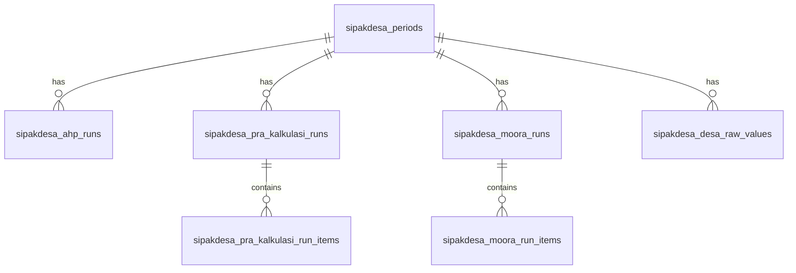

# SIPAKDESA Sleman (Sistem Pendukung Keputusan Prioritas Alokasi Dana Desa)

Aplikasi **SIPAKDESA Sleman** merupakan perangkat lunak berbasis web (*web application*) yang diposisikan sebagai instrumen pengambil keputusan (*Decision Support Systems*) tingkat tinggi pada Dinas Pemberdayaan Masyarakat dan Kalurahan (DPMK) Kabupaten Sleman. Sistem ini mengombinasikan keunggulan metode hibrida *Analytic Hierarchy Process* (AHP) dan *Multi-Objective Optimization on the basis of Ratio Analysis* (MOORA) untuk mengelola variabel beban kerja kuantitatif 86 kalurahan guna menghasilkan rincian alokasi anggaran formula yang objektif, real-time, dan berkondisi *Zero Gap*.

---

## 🚀 Fitur Utama Sistem (System Core Modules)

*   **Autentikasi Sesi (Supabase Auth & JWT):** Pembatasan hak akses berbasis peran (*Role-Based Access Control*) antara *Super Admin* dan *Admin*.
*   **Dinamis Parameter Kontrol:** Modul pengelolaan kriteria kustom (kualitatif & kuantitatif), pembatasan gembok periode operasional (*period lock state*), serta konfigurasi formasi dan tarif tunjangan kelembagaan BPKal se-Sleman.
*   **AHP Engine (ahp.js):** Penginputan matriks perbandingan berpasangan Saaty (1-9) dengan fitur validasi otomatis ambang batas *Consistency Ratio* (CR ≤ 0.1).
*   **Belanja Earmark (Belanja Kaku Pra-Kalkulasi):** Komputasi otomatis belanja kaku kalurahan (siltap lurah & perangkat, tunjangan BPKal, premi BPJS Kesehatan 4% dan Ketenagakerjaan 1% berbasis UMK, serta anggaran kebijakan THR/Gaji-13) sebelum pembagian dana MOORA dilakukan.
*   **MOORA Engine (moora.js):** Komputasi normalisasi matriks keputusan kuantitatif melalui pembagi akar kuadrat kuadrat (vektor normalisasi) guna mendistribusikan sisa pagu secara proporsional.
*   **Pelaporan & Administrasi Kedinasan:** Fasilitas ekspor draf hasil analisis ke format PDF serta draf lampiran Surat Keputusan (SK) Bupati Sleman ke format berkas Excel (.xls) berpemulihan metadata dinamis (Nomor SK, Tanggal, dan Nama Bupati).

---

## 📊 Metodologi Pendukung Keputusan (Hybrid DSS)

Untuk menghasilkan pembagian pagu yang bebas dari subjektivitas administratif, SIPAKDESA mengintegrasikan tiga tahap komputasi optimasi matematis secara berurutan:

### A. Analytic Hierarchy Process (AHP)
Metode ini digunakan untuk mencari kontribusi bobot prioritas tingkat kepentingan relatif masing-masing kriteria evaluasi (C1 s.d C5 atau kriteria kustom tambahan).
*   **Matriks Berpasangan**: Mengadopsi skala 1–9 Saaty untuk input perbandingan berpasangan (pairwise comparison) pada sel segitiga atas matriks kriteria.
*   **Reciprocal & Diagonal**: Sel diagonal terkunci pada nilai `1` dan sel segitiga bawah diisi nilai pecahan reciprocal secara otomatis.
*   **Consistency Ratio (CR)**: Sistem menghitung nilai Consistency Index (CI) dan Consistency Ratio (CR) secara real-time. Bobot kriteria hanya dapat disimpan jika matriks dinilai konsisten secara matematis (**CR < 0.10**).

### B. Belanja Earmark (Belanja Kaku Pra-Kalkulasi)
Sebelum pagu disebar menggunakan MOORA, sistem melakukan kalkulasi penguncian belanja wajib pegawai/operasional (*Earmark*) untuk mengamankan belanja pokok kalurahan:
*   **Gaji Pokok & Tunjangan Siltap**: Siltap bulanan Lurah, Carik, Kepala Seksi/Kaur, dan Dukuh.
*   **Tunjangan BPKal**: Formasi tunjangan bulanan (Ketua, Wakil, Sekretaris, Bidang, Anggota BPKal) terintegrasi dengan template formasi (misal template 9 kursi).
*   **Jaminan Kesehatan & Ketenagakerjaan**: Potongan premi BPJS Kesehatan (4%) dan BPJS Ketenagakerjaan (1%) berbasis nominal UMK Sleman aktif dan jumlah staf tanggungan.
*   **Kebijakan Tambahan**: Akumulasi opsional untuk THR dan Gaji Ke-13 (masing-masing senilai 1 bulan gaji siltap pokok).
*   **Sisa Pagu Bersih (ADD Kewenangan)**: Sisa alokasi pagu bersih setelah dikurangi potongan belanja kaku inilah yang kemudian dikirim ke modul MOORA untuk diranking dan dialokasikan secara proporsional.

### C. Multi-Objective Optimization on the basis of Ratio Analysis (MOORA)
Metode optimasi ini memproses sisa pagu bersih (ADD Kewenangan) untuk didistribusikan kepada 86 Kalurahan:
*   **Normalisasi Matriks**: Mengubah nilai mentah kriteria menjadi matriks normalisasi menggunakan pembagi kuadratik sum.
*   **Optimasi Rasio**: Mengalikan matriks ternormalisasi dengan bobot prioritas ($w_j$) hasil AHP.
*   **Skor Kelayakan ($Y_i$)**: Menghitung selisih kriteria benefit (menguntungkan, seperti jumlah penduduk miskin C2, indeks kesulitan geografis C5, dll.) dan kriteria cost (merugikan/pengurang).
*   **Alokasi Neto Proporsional**: Mengalokasikan dana secara dinamis berdasarkan porsi nilai kelayakan positif ($Y_i$) masing-masing kalurahan demi mewujudkan asas *Zero Gap* (seluruh anggaran daerah terdistribusi habis tanpa sisa).

---

## 🛠️ Spesifikasi Teknologi (Tech Stack & Environment)

*   **Front-End Framework:** React.js (v18+) & Vite Engine (Kompilasi cepat)
*   **Styling Engine:** Tailwind CSS & Tailwind UI Components
*   **Database & Backend Service:** Supabase (PostgreSQL relational engine)
*   **Deployment Hosting:** Vercel Serverless Infrastructure (Live Production)
*   **Containerization Infrastructure:** Docker Desktop & Nginx Web Server Hardening

---

## 📁 Struktur Direktori Proyek

```text
sipakdesa-sleman/
├── src/
│   ├── components/       # Komponen reusable (Charts, Sidebar, PrivateRoute, dll)
│   ├── context/          # State global (AuthContext, PeriodContext, DialogProvider)
│   ├── layouts/          # Layout template halaman (AdminLayout)
│   ├── pages/            # View halaman utama (Login, Dashboard, DataDesa, BPKal, dll)
│   ├── services/         # Handler API data Supabase (userService, desaService, dll)
│   ├── supabase/         # Inisialisasi klien SupabaseConfig
│   ├── utils/            # Javascript Calculation Engines (ahp.js, moora.js, praKalkulasi.js)
│   ├── App.jsx           # Routing Client-Side
│   └── main.jsx          # Entry point aplikasi
├── dist/                 # Bundel build produksi untuk deployment
├── schema.sql            # Struktur DDL PostgreSQL Supabase (13 Tabel, Triggers, RLS)
├── package.json          # Manajemen dependensi dan script npm
└── README.md             # Dokumentasi utama proyek
```

---

## 🗄️ Gambaran Database Relasional (Supabase PostgreSQL)

SIPAKDESA menggunakan 13 tabel relasional yang saling terhubung dengan skema integritas referensial cascade (`ON DELETE CASCADE`) yang berpusat pada tabel periode (`sipakdesa_periods`).



---

## ⚙️ Panduan Instalasi & Peluncuran

### A. Jalur Pengembangan Lokal (Local Development npm)

#### 1. Prasyarat
*   Node.js versi LTS terbaru (direkomendasikan v18 ke atas)
*   npm (Node Package Manager)

#### 2. Langkah-langkah
1.  **Kloning Repositori**:
    ```bash
    git clone https://github.com/sipakdesa-sleman/sipakdesa-sleman.git
    cd sipakdesa-sleman
    ```
2.  **Pengaturan Environment Variables**:
    Buat berkas `.env` di direktori utama (root) proyek dan konfigurasikan URL serta Anon Key Supabase Anda:
    ```env
    VITE_SUPABASE_URL=https://your-supabase-project.supabase.co
    VITE_SUPABASE_ANON_KEY=your-anonymous-key-here
    ```
3.  **Instalasi Dependensi**:
    ```bash
    npm install
    ```
4.  **Menjalankan Server Pengembangan Lokal**:
    ```bash
    npm run dev
    ```
    Aplikasi akan berjalan secara lokal di alamat `http://localhost:5173`.
5.  **Linting Kode (ESLint Check)**:
    ```bash
    npm run lint
    ```
6.  **Membangun Bundel Produksi (Build)**:
    ```bash
    npm run build
    ```

---

### B. Jalur Produksi Jangka Panjang (Production Docker Compose)

Folder proyek ini telah dilengkapi dengan spesifikasi konfigurasi kontainerisasi **Docker Multi-Stage Build** yang diorkestrasikan secara persisten via **Docker Compose**. Infrastruktur ini menggunakan web server *Nginx Alpine Hardening* yang dikonfigurasi khusus dengan sistem pengamanan *Anti-Clickjacking* (`X-Frame-Options "DENY"`) serta *reverse-routing proxy* untuk mengamankan React Router dari galat 404.

#### 1. Prasyarat Sistem
Pastikan server lokal atau perangkat komputer host instansi telah terpasang:
*   **Docker Desktop** atau **Docker Engine** (Versi terbaru)
*   **Docker Compose Plugin**

#### 2. Konfigurasi Kunci API Produksi (.env)
Sebelum menyalakan kontainer, buat atau pastikan file `.env` pada direktori root proyek telah terisi parameter autentikasi cloud Supabase resmi milik DPMK Sleman:
```text
VITE_SUPABASE_URL=https://supabase.co
VITE_SUPABASE_ANON_KEY=eyJhbGciOiJIUzI1NiIsInR5cCI6IkpXVCJ9...
```

#### 3. Eksekusi Peluncuran Satu Baris Perintah
Buka aplikasi terminal (*Command Prompt / Linux Terminal / Bash*) tepat pada direktori root utama project yang memuat file `docker-compose.yml`, lalu jalankan instruksi otomatis berikut:
```bash
# Membangun Image, menyuntikkan argumen .env, dan menyalakan kontainer di latar belakang (detached mode)
docker compose up -d --build
```

#### 4. Verifikasi dan Manajemen Log Akses Kontainer
Setelah proses kompilasi otomatis selesai, sistem informasi **SIPAKDESA Sleman** akan mengudara secara persisten pada port **8080** dan dapat diakses lokal melalui peramban web browser di alamat `http://localhost:8080`.

Untuk memantau lalu lintas data payload JSON atau melakukan audit forensik keamanan siber, tim IT DPMK dapat memeriksa berkas log Nginx luar yang terhubung secara persisten (*volume mapping*) pada host melalui perintah:
```bash
# Meninjau catatan log kesalahan server secara real-time
tail -f ./logs/nginx/error.log
```

---

## 🛡️ Aspek Keamanan Informasi & Pengerasan Sistem (Security Hardening)

1.  **SSL/TLS Enkripsi:** Memaksa lalu lintas komunikasi payloads JSON berjalan murni pada protokol aman HTTPS (RSA 2048-bit encryption) pada live deployment `https://sipakdesa-sleman.web.id`.
2.  **CORS Allowed Origins:** Gerbang API Supabase dikunci secara kaku, hanya merespons kueri jika dikirimkan dari domain produksi resmi yang terdaftar.
3.  **Row Level Security (RLS):** Seluruh baris data diisolasi menggunakan token JWT pengguna, mencegah akses modifikasi ilegal lintas akun staf operasional.

---

## 📄 Hak Cipta & Dokumen Pendukung

*   **Penyusun & Arsitek Utama:** Stieven Christian Senduk (stievansenduk@gmail.com)
*   **Dokumentasi Lengkap:** Panduan pengoperasian rinci, gambar tangkapan layar antarmuka, serta 15 kasus penanganan darurat (*troubleshooting*) dapat dibaca pada berkas **Buku Panduan Pengguna (*User Manual Book*) SIPAKDESA Sleman** yang dilampirkan dalam folder paket serah terima ini. Documentation tersebut dipersiapkan secara resmi sebagai prasyarat pendaftaran Hak Cipta Program Komputer ke LPPM UMBY.
